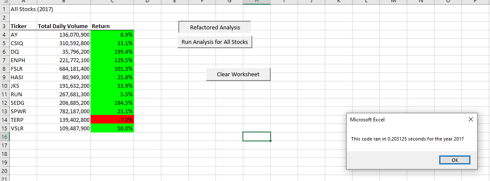
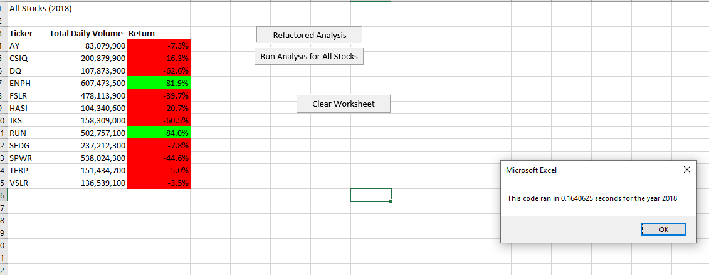
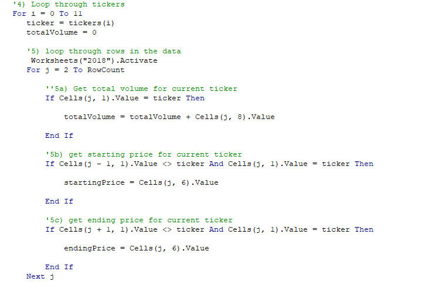
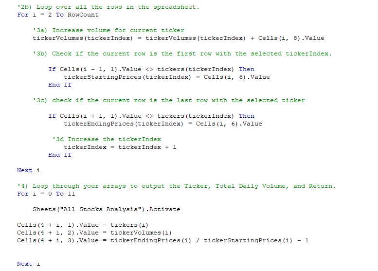

# Stock Analysis Project Overview

## Main Purpose
The main purpose of this project was to provide an evidence-based approach to choosing which stocks from a given list to invest in, based on their performance during 2017 and 2018.

### Secondary Purpose
The secondary purpose of this project was to use refactoring to improve the VBA code in order to make it cleaner and more efficient through the use of loops.

## Main Results
Of the 12 stocks analyzed in this project, all except two (ENPH and RUN) performed poorly in 2018, ending the year at a lower value than they began it. Additionally, half of the stocks also performed more poorly in 2018 than they did in 2017. The only two consistently well-peforming stocks were ENPH and RUN.

###### 2017 Stock Performance

###### 2018 Stock Performance

### Secondary Results
In addition to showing stock performarnce for each year, the two screenshots above show how long the refactored VBA code took to run and return those results (see popups within the screenshots). Each calculation took less than one second to run.  We can compare this to the original (non-refactored) code that took over a second to run each time and see that there was indeed an improvement in run-time.

## Summary
Refactoring code can be beneficial when it improves readability and efficiency and is executed correctly. But when a programmer either introduces errors to an already-functioning piece of code or changes something perfectly functional simply because that person prefers to do things a certain way (the "six of one, half dozen of the other" mentality), then refactoring becomes disadvantagous or even dangerous.

In the case of this particular project, refactoring was beneficial because it streamlined our code (increased efficiency) so that it only loops through the data a single time to collect all the necessary information for our analysis.

###### Original Loop Code

###### Refactored Loop Code
